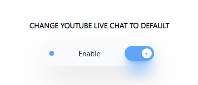

# Change YouTube Live Chat to Default

Automatically changes the YouTube stream chat to "Live chat" for streamers.

It works on Chrome and Edge (as far as I know).

## Installation

1. Install NodeJS if you don't already have it: https://nodejs.org.
2. Install PNPM if you don't already have it: `npm i -g pnpm`.
3. `pnpm i`.
4. Run `pnpm postcss:popup:watch` to create `src/popup.min.css`.
5. Navigate to `chrome://extensions` in your browser.
6. Toggle ON "Developer mode".
7. Click "Load unpacked" to upload the package.

## Report

If there are any issues, feel free to create an issue.

## Resources

-   https://developer.chrome.com/docs/extensions/
-   https://www.google.com/search?q=how+to+change+youtube+stream+top+message+to+default+to+all&oq=how+to+change+youtube+stream+top+message+to+default+to+all&aqs=chrome..69i57j33i160l2.10851j0j7&sourceid=chrome&ie=UTF-8
-   https://www.reddit.com/r/youtube/comments/hhuz29/enable_live_chat_by_default_instead_of_top_chat/
-   https://www.reddit.com/r/youtube/comments/16kiyz9/enable_live_chat_by_default_instead_of_top_chat/
